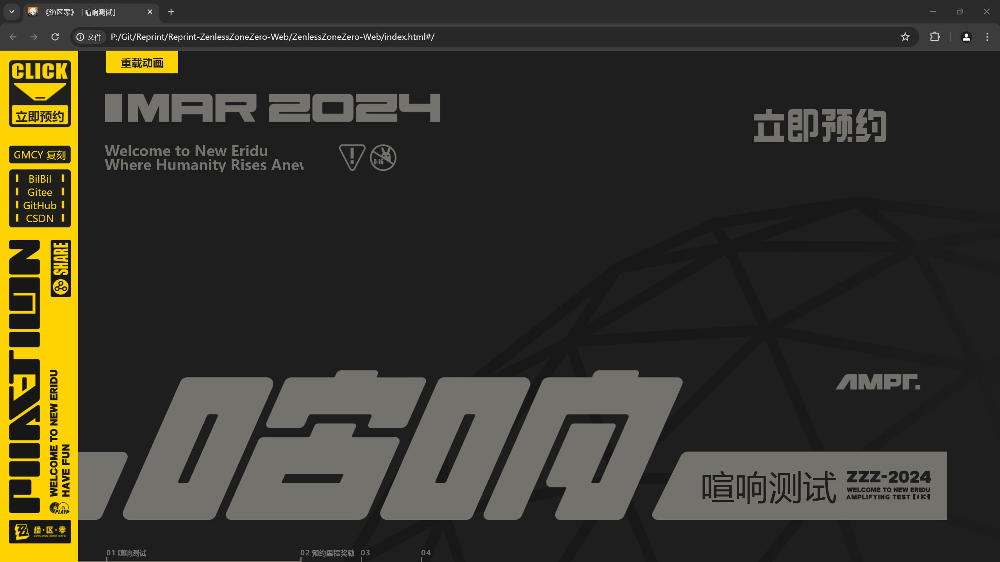
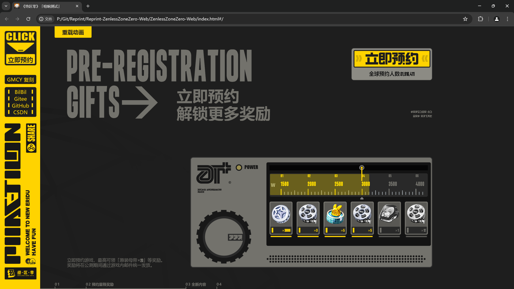
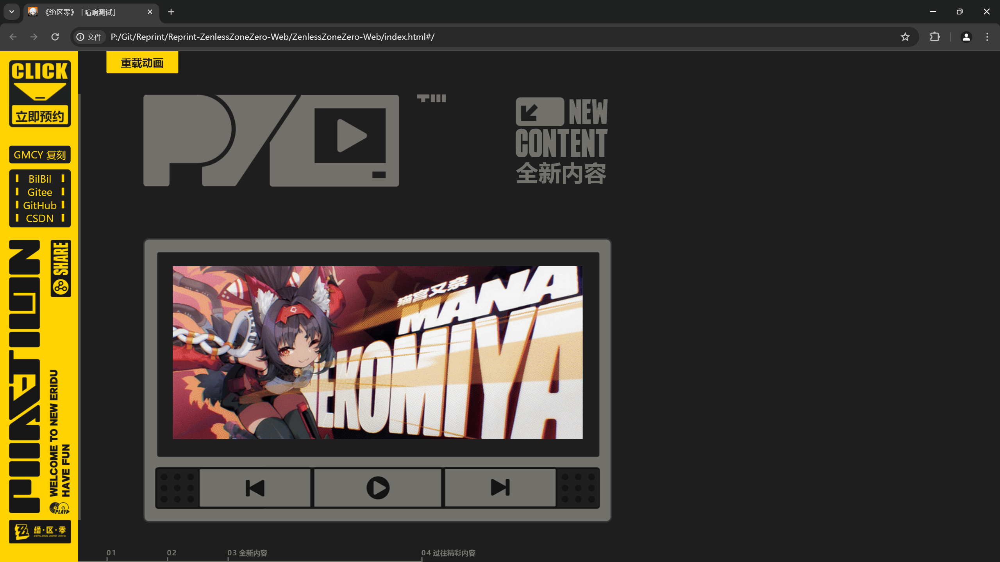
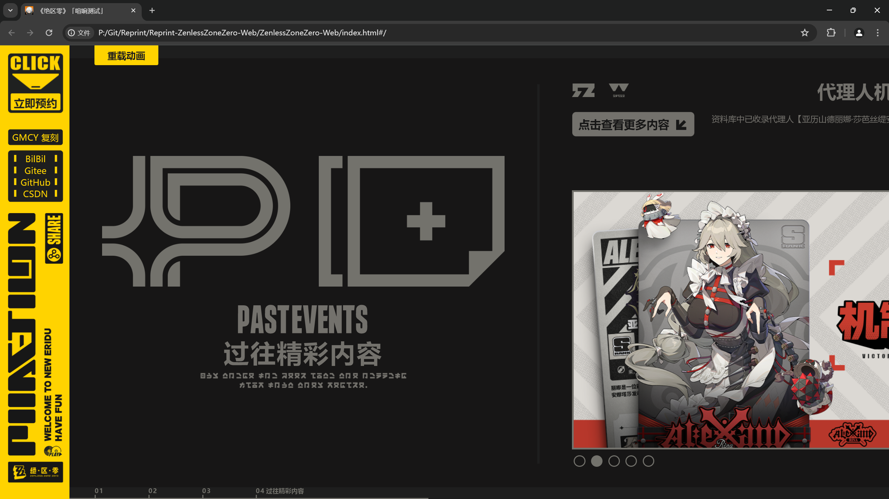
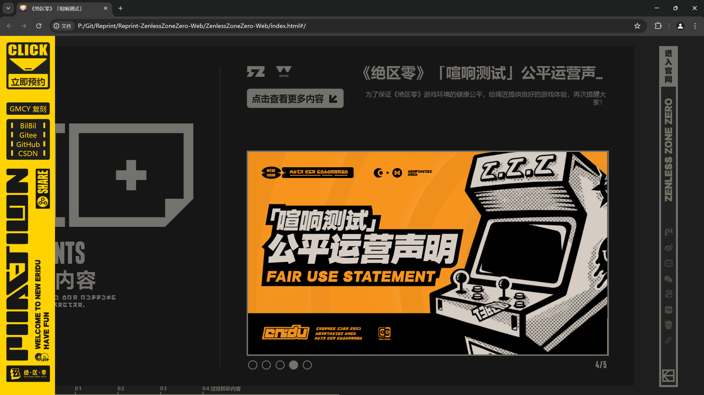
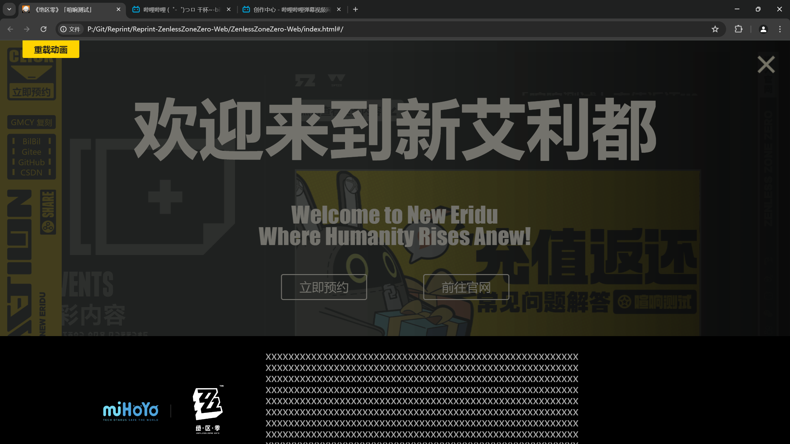

# 复刻绝区零官网「喧响测试」

## 0. 视频

- B站演示: [BilBil](https://www.bilibili.com/video/BV1gw4m117HT/)

## 1. 基本信息

- 作者: GMCY
- 系列: 复刻系列
- 网站: [绝区零「喧响测试」- 复刻的](https://gmcy2020.github.io/Reprint-ZenlessZoneZero-Web/)
- 仓库: [GitHub](https://github.com/GMCY2020/Reprint-ZenlessZoneZero-Web) | [Gitee](https://gitee.com/GMCY2020/Reprint-ZenlessZoneZero-Web)
- 话题(GitHub): [vue](https://github.com/topics/vue) \ [reprint](https://github.com/topics/reprint) \ [mihoyo](https://github.com/topics/mihoyo) \ [ZenlessZoneZero](https://github.com/topics/ZenlessZoneZero)
- 创建时间: 2024/04/29

## 2. 介绍

- 项目参考 [绝区零「喧响测试」- 官网](https://zzz.mihoyo.com/) , 进行模仿
- 项目图片视频等资源来自绝区零官网, 仅编程学习用
- 绝区零官网官网的样式参考创建时间前的
- 基本信息中的网站, 国内访问GitHub网络问题. 可能有延迟, 图片未更新, 图片未加载等问题. 项目下载到本地应该不卡.
- 个人学习自用

## 3. 环境

编辑器

- `VSCode`

框架

- `vue3`

## 4. 效果图

PC端

手机端
 